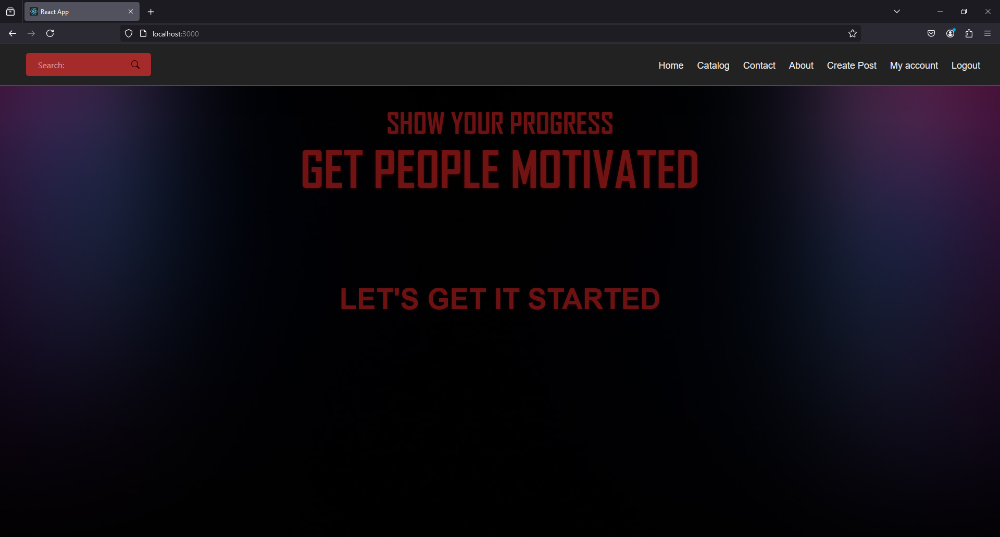
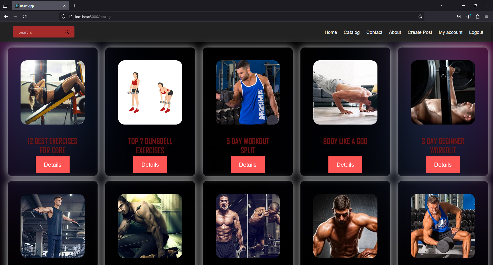
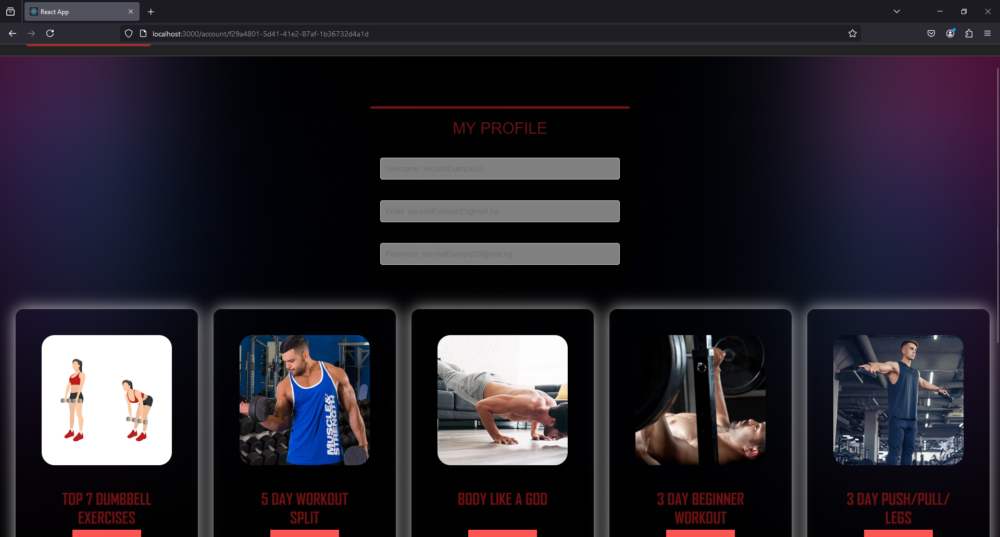
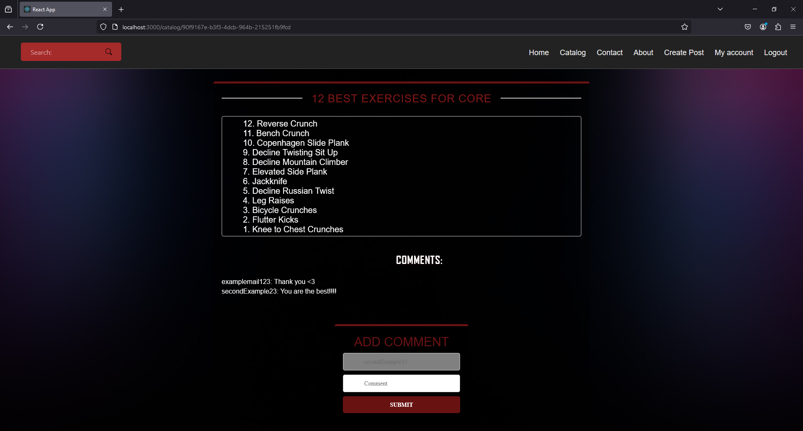

# Fitness App

## Table of Contents

1. [Overview](#overview)
2. [Features](#features)
3. [Screenshots](#screenshots)
4. [Setup Instructions](#setup-instructions)
5. [Usage](#usage)

---

## Overview

The Fitness App is a modern web application designed to help users manage their fitness journey effectively. It allows users to browse posts, view their profile, and interact with content via a dynamic and responsive interface.

---

## Features

- **Home Page**: A landing page displaying key information and navigation.
- **Catalog**: Browse available fitness posts or plans.
- **My Profile**: Personalized dashboard to manage fitness data.
- **Post**: View detailed information about individual posts.

---

## Screenshots

1. **Home Page**



2. **Catalog**



3. **My Profile**



4. **Post**



---

## Setup Instructions

### Prerequisites

- [Node.js](https://nodejs.org/) (v14 or later recommended)

### Steps

- Clone the repository:

```bash
git clone https://github.com/100QNKolev/fitness-app.git
```
- Start the server:

```bash
cd fitness-app/server
node server.js
```

- Open a new terminal, navigate to the src directory, and install dependencies:

```bash
cd fitness-app/src
npm install
```

- Start the frontend:

```bash
npm start
```

**Open your browser and navigate to http://localhost:3000 to use the app.**

## Usage

Once the app is running:

Access the Home Page to explore the application.

Browse available fitness posts via the Catalog.

Manage personal information and posts in My Profile.

View detailed content in the Post section.